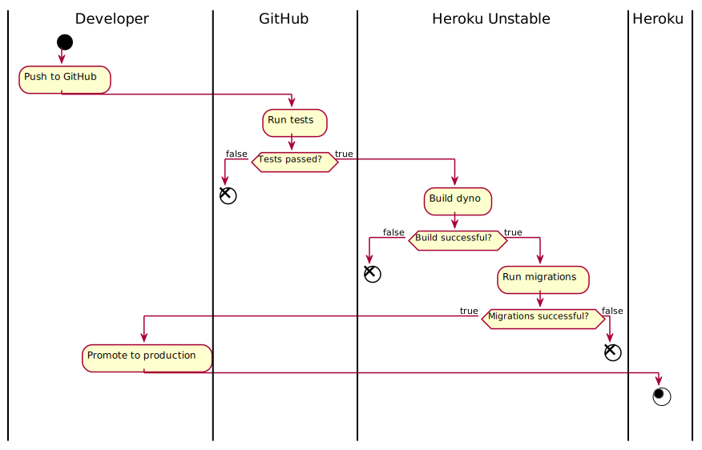

# appoint.er
> ⚠️ Do **not** edit on GitLab. Changes will be overwritten on the next push to GitHub.

## Entwicklung
Während der Entwicklung haben wir den [Laravel IDE Helper](https://github.com/barryvdh/laravel-ide-helper) und die [Laravel Debugbar](https://github.com/barryvdh/laravel-debugbar) eingesetzt.
Für häufige Funktionen ist eine `Makefile` beigefügt.

Unser Code ist auf GitHub gehosted und wird bei jedem Push oder Pull Request mittels GitHub Actions getestet.
Weiterhin ist der Code mit Typ-Annotationen versehen und mittels [Larastan](https://github.com/nunomaduro/larastan) auf Korrektheit prüfbar.  
Die `master`-Branch wird, ebenfalls mittels einer GitHub Action auf die GitLab Instanz übertragen.
Zusätzlich findet nach jedem Push ein [Deployment](#Deployment) auf Heroku statt.

## Technische implementierung
Wir verwenden [Resource Controller](https://laravel.com/docs/7.x/controllers#resource-controllers).
* Authorization ist über die den Controllern entsprechenden Policies implementiert.
    * Korrektheit ist mittels Tests sichergestellt.
* Validation über die `rules()`-Methode in entsprechenden Requests.
* View namen folgen weitestgehend den durch die Resource Controller vordefinierten Methodennamen.
* Benachrichtigungen können über den `toasts`-Stack in der Session gespeichert und beim nächsten Seitenaufruf angezeigt werden.
    * Sind über Bootstrap Toasts implementiert.
* Favicons in allen relevanten Formaten sind beigefügt.

### Deployment
Deploys auf unserer [unstable environment](https://appoint-er-unstable.herokuapp.com) laufen automatisch bei jedem GitHub push.
Der deploy auf die [production environment](https://appoint-er.herokuapp.com) müssen manuell aus dem Heroku Dashboard ausgelöst werden.

    

#### Webserver
Für verbesserte Performance verwenden auf Heroku nginx anstatt eines Apache-Servers und haben `gzip` aktiviert.

#### Datenbank
Als Datenbank verwenden wir eine auf Heroku gehostete Postgres-Instanz.
Aller Code ist jedoch unabhängig von der Datenbank geschrieben und läuft auch auf einer MySQL Datenbank.
Bei jedem Release wird, sowohl auf `unstable` als auch auf `production` wird die Datenbank gelöscht und mit neuen Seed-Daten befüllt (Siehe [hier](Procfile)). 
